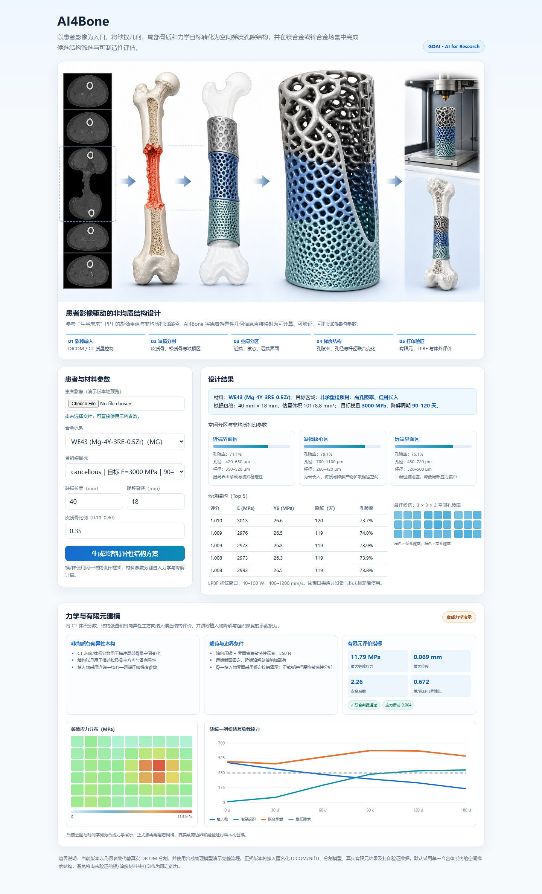

# AI4Bone

AI4Bone 是面向骨缺损修复的患者特异性可降解金属植入物设计工具，参赛方向为 GOAI 世界人工智能开源大赛「AI for Research」。项目以镁合金和锌合金为应用场景，将患者缺损几何、局部骨质和力学目标转化为空间梯度孔隙结构，并输出候选结构与增材制造初筛参数。



- [45.5 秒力学与有限元流程视频](docs/AI4Bone_mechanics_FEM_demo.mp4)
- [AI4Bone 问题定义文档（力学有限元增强版，PDF）](docs/AI4Bone_problem_definition_mechanics.pdf)

## 核心流程

1. DICOM/CT 导入与质量控制；
2. 皮质骨、松质骨及缺损区域分割；
3. 缺损包络重建与近端—核心—远端空间分区；
4. 孔隙率、孔径和杆径的非均质结构设计；
5. CT 体积分数与结构张量驱动的非均质各向异性力学建模；
6. 有限元、降解和可制造性联合筛选；
7. LPBF 打印及体外/动物实验验证。

当前演示版使用缺损长度、髓腔直径和皮质骨比例代替真实影像分割结果，并使用透明的合成物理模型演示完整计算链。正式版本将接入匿名化 DICOM/NIfTI、真实有限元结果和打印验证数据。

## 力学与有限元建模

- **模型输入**：CT 灰度/体积分数场、结构张量主方向、患者缺损包络与近端—核心—远端梯度参数。
- **边界条件**：远端截面固定，近端沿解剖轴加载；轴向压缩之外筛查界面弯曲与接触敏感性。
- **输出指标**：最大等效应力、最大位移、安全系数、应力屏蔽比与横/纵向各向异性比。
- **时间评价**：同时跟踪植入物承载下降、修复组织承载上升和联合承载下限。

Web Demo 中的应力分布与时间序列为合成力学演示，用于验证数据结构与交互流程；正式结果需由患者网格、经标定材料本构、真实载荷边界和实验验证替换。

## 模块

- `src/structure_design.py`：患者特异性空间梯度结构设计与候选筛选。
- `src/mg_alloy_baseline.py`：镁合金成分—性能预测与逆向设计基线。
- `src/phage_baseline.py`：感染性骨缺损内溶素候选排序骨架。
- `web/main.py`：FastAPI 后端。
- `web/static/index.html`：交互式 Web Demo。
- `data/materials_lib.json`：镁/锌材料参数与骨组织目标库。

## 镁合金与锌合金场景

结构设计框架对材料体系保持一致，材料的弹性模量、屈服强度和降解时间尺度由 `data/materials_lib.json` 注入。默认采用**单一合金体系内的空间梯度结构**；镁/锌多材料共打印仅作为后续研究方向，不作为当前已验证能力。

- 镁合金成分—性能模型使用 Zenodo 数据集 `DatasetMg_imputed.csv`。
- 原始数据含 600 行、28 列；清洗后保留 572 个有效样本。
- 锌合金成分模型仍需独立数据集，现阶段以材料参数库支持结构场景切换。

数据集：[Zenodo record 17672235](https://zenodo.org/records/17672235)

## 本地运行

```bash
pip install -r requirements.txt
python -m uvicorn web.main:app --host 127.0.0.1 --port 8765
```

浏览器打开：<http://127.0.0.1:8765>

命令行示例：

```bash
python src/structure_design.py --material we43_mg --site cancellous \
  --defect-length 40 --canal-diameter 18 --cortical-ratio 0.35

python src/structure_design.py --material zn_1mg --site cortical
python src/mg_alloy_baseline.py
python src/phage_baseline.py
```

## API

- `GET /api/meta`：材料、骨组织目标和 LPBF 初筛参数。
- `POST /api/design`：生成患者特异性候选结构。

请求示例：

```json
{
  "material": "we43_mg",
  "site": "cancellous",
  "defect_length_mm": 40,
  "canal_diameter_mm": 18,
  "cortical_ratio": 0.35,
  "seed": 42
}
```

## 可复现性与边界

- 固定随机种子：`SEED=42`。
- 镁合金数据集文件被 `.gitignore` 排除，README 提供公开下载地址。
- 当前有限元输出为合成物理演示，不代表临床结论。
- LPBF 参数为筛选性窗口，正式打印前须按设备、粉末和试样进行标定。

## License

MIT
